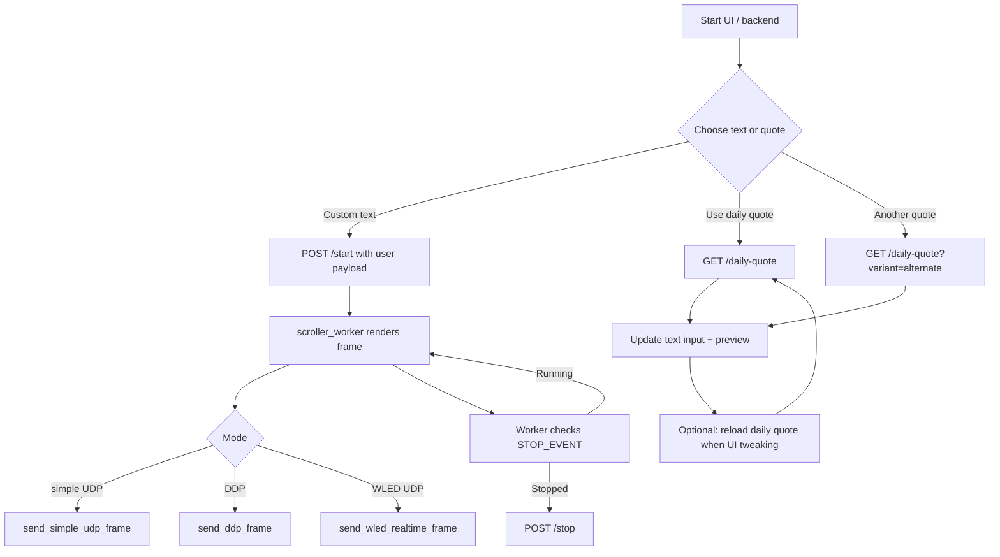

# LED Text Scroller User Guide

## Overview
The repository runs a Flask-based controller for a 16×64 LED matrix. `app.py` runs the HTTP frontend and a background worker that renders text frames and streams them over UDP. The UI (`templates/index.html`) lets you pick text, fonts, speed, gradients, and UDP/DDP modes while previewing the animation locally. The generator script (`daily_quote_generator.py`) generates inspirational text via OpenAI (with fallbacks) and is wired into the UI.

---

## High-Level Flow

## Getting Started
1. Create or export an OpenAI key: set `OPENAI_API_KEY` or drop the key into `~/Documents/keys/OpenAIAPI.txt`.
2. Install dependencies: `pip install -r requirements.txt` (ensure `openai`, `flask`, `pillow`, `pilmoji`, `emoji==1.7.0`).
3. Activate the virtual environment (`source .venv/bin/activate`).
4. Start the app: `python app.py`. It listens on http://127.0.0.1:5080 by default (see `DEV_HOST`/`DEV_PORT`).
5. Alternatively deploy with Gunicorn (see README). Ensure launchctl service or other supervisor keeps the app running if needed.

## Web UI Controls
- **Text / Fonts**: Type your message and select a system font. The dropdown populates from macOS/Linux standard font directories.
- **Font Size / Emoji Offset**: Adjust size; shift emoji baseline with the offset control if they look misaligned.
- **Speed / Direction**: Scroll speed affects the worker delay. Setting `Display` to `static` locks the text in place and disables speed/direction inputs.
- **Color Mode**: Choose `solid` (picks a color) or `gradient` (choose a preset, reverse, and animate shift).
- **Layout & Mode**: `layout` toggles serpentine vs progressive wiring; `mode` selects between Simple UDP, DDP, or WLED UDP and auto-adjusts the port input. Enter target IP/port, or leave defaults for local dev preview.
- **Preview**: The local canvas mirrors what is sent. Use the scale slider, grid toggle, and crisp toggle to tune the look. Play/pause/reset manually animate without affecting the worker.
- **Quote Buttons**: `Use daily quote` hits `/daily-quote` and writes the deterministic daily text; `Reload daily quote` reapplies the most recently fetched daily quote; `Another quote` requests `/daily-quote?variant=alternate` for a fresh LLM-generated message.

## Flask Endpoints
- `GET /`: Serves `index.html` with font list and defaults.
- `POST /start`: Accepts JSON payload describing text, font, colors, motion, UDP mode, etc. Stops any running worker and starts a new thread (`scroller_worker`) that renders frames via `render_static_frame` or `render_scroll_window_frame`. Supports crisp rendering, gradients, emoji-aware fonts, and serpentine mapping.
- `POST /stop`: Stops the running worker thread gracefully.
- `GET /daily-quote`: Returns JSON `{ok:true, quote:"..."}` by calling `daily_quote_generator.get_daily_quote()` or, when `variant=alternate`, `get_fresh_quote()` to force another OpenAI request.
- `GET /healthz`: Returns `ok` for health checks.

## Background Worker Highlights
- The worker uses `PIL.Image` and optional `Pilmoji` for emojis. It renders to 64×16, centers text, and optionally clips for center-short mode.
- `remap_serpentine` toggles pixel ordering when running serpentine layouts.
- Supports three senders: `send_simple_udp_frame`, `send_ddp_frame`, and `send_wled_realtime_frame` that can be directed via config.
- Gradient support uses HSL presets, shiftable horizontally; static mode animates gradients by time.

## Quotes & OpenAI Integration
- `daily_quote_generator.py` tries OpenAI chat completions (`gpt-4.1` by default) using `OPENAI_API_KEY` or the fallback file, cleaning any quote formatting.
- `get_daily_quote()` fetches the AI quote or falls back to a deterministic entry based on the current YYYYMMDD date.
- `get_fresh_quote()` always re-runs the AI call and only falls back to `FALLBACK_QUOTES` if OpenAI is unavailable, ensuring the `Another quote` button returns new phrasing.
- The script prints warnings if the key is missing and saves the daily quote to `today_quote.txt` for LED screen consumption.

## Troubleshooting
- If the UI looks frozen, check `/stop`/`/start` responses and ensure no worker thread is hung; use Flask logs for errors.
- OpenAI API errors print `❌ API call failed`; inspect the terminal output for HTTP errors (e.g., 402) and verify billing/quota.
- For UDP delivery issues, confirm the target IP/port match the LED controller and that the network allows the traffic.
- Use the `/healthz` endpoint and `curl` to confirm the Flask service is healthy after deployment.

## Extending the App
- Add more fallback quotes by editing `FALLBACK_QUOTES` in `daily_quote_generator.py`.
- Tune `MATRIX_W`, `MATRIX_H`, or gradient presets in `app.py` to match different matrices.
- Replace `OpenAI_MODEL` or add configuration knobs if you want to switch to `gpt-4o-mini` or other models.
